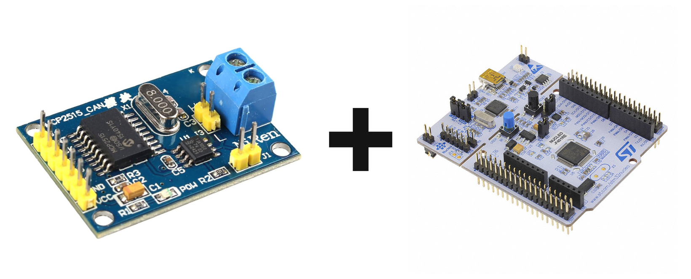

# STM32 + MCP2515 CANbus module

In this repository we are going to write code for operating the MCP2515-TJA1050 module which is extremely common in aliexpress and can cost under 2$ including shipping. 

The code will also make use of the microchip official MCP2515 CAN Controller PICtail Demo Board Firmware which can be found in the link below under the tab "software":

- [MCP2515 CAN CONTROLLER PICTAIL DEMO BOARD](https://www.microchip.com/en-us/development-tool/mcp2515dm-pctl)
- [MCP2515 CAN Controller PICtail Demo Board Firmware](https://ww1.microchip.com/downloads/aemDocuments/documents/OTH/ProductDocuments/SoftwareLibraries/Firmware/00023R2Firmware.zip) 
